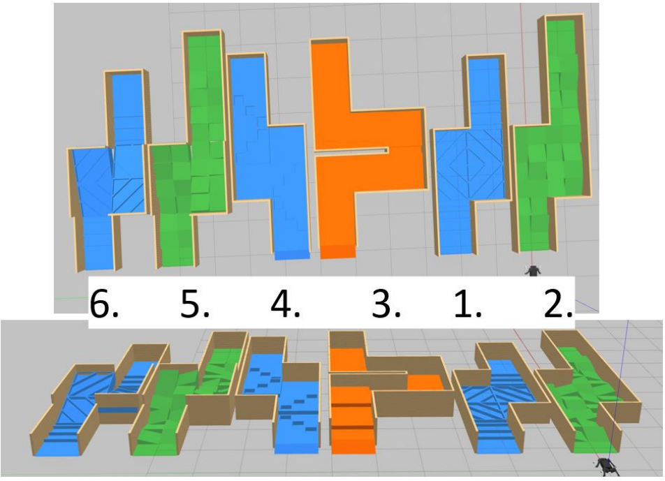

# Control de Robot Cuadrúpedo con NMPC en Entorno Simulado

Este repositorio contiene los archivos necesarios para ejecutar una estrategia de control basada en NMPC (Nonlinear Model Predictive Control) para un robot cuadrúpedo Unitree A1 en un entorno simulado. El objetivo es completar con éxito cuatro niveles de dificultad (niveles 1, 2, 4 y 5), modificando parámetros específicos de forma manual para cada uno.

## Estructura del Repositorio

Cada carpeta (`nivel_1`, `nivel_2`, `nivel_4`, `nivel_5`) contiene:

- `task.info`: configuración del controlador NMPC adaptada al nivel.
- `waypoint.py`: script Python que gestiona la trayectoria y el comportamiento del robot.

El archivo `full_sim.launch` **no está incluido** en las carpetas. El usuario debe modificarlo manualmente para ajustar la posición inicial del robot según el nivel.

## Requisitos

- Escritorio virtual de la UPM.
- Workspace: `muar_ws`.
- Ruta base del proyecto:
  ```
  /home/upm/muar_ws/src/legged_robots-master/
  ```

## Configuración por Nivel

### 1. Sustituir archivos

**`task.info`**  
Copiar en:
```
/home/upm/muar_ws/src/legged_robots-master/legged_controllers/config/a1/task.info
```

**`waypoint.py`**  
Copiar en cualquier ruta.

### 2. Modificar la posición inicial del robot

En el archivo:

```
/home/upm/muar_ws/src/legged_robots-master/legged_examples/legged_unitree/legged_unitree_description/launch/full_sim.launch
```

Buscar la línea:
```xml
args="-z 0.5 -param legged_robot_description -urdf -model $(arg robot_type)" output="screen"/>
```

Y reemplazarla por una versión que incluya los valores `-x` y `-y` adecuados para el nivel, por ejemplo:

| Nivel   | Coordenada Y | Línea modificada                                                                 |
|---------|--------------|-----------------------------------------------------------------------------------|
| Nivel 1 | 2.2          | `args="-x 0.0 -y 2.2 -z 0.5 -param legged_robot_description -urdf -model $(arg robot_type)" output="screen"/>` |
| Nivel 2 | 0.0          | `args="-x 0.0 -y 0.0 -z 0.5 -param legged_robot_description -urdf -model $(arg robot_type)" output="screen"/>` |
| Nivel 4 | 6.8          | `args="-x 0.0 -y 6.8 -z 0.5 -param legged_robot_description -urdf -model $(arg robot_type)" output="screen"/>` |

> ⚠️ Este paso es obligatorio para garantizar que el robot aparezca en el punto de partida correcto del entorno simulado.

---

## Instrucciones de Ejecución

Abre varias terminales y ejecuta los siguientes comandos **en orden**:

### 1. Lanzar la simulación
```bash
roslaunch legged_unitree_description full_sim.launch
```

### 2. Cargar el controlador
```bash
roslaunch legged_controllers load_controller.launch cheater:=false
```

### 3. Activar el controlador
```bash
rosservice call /controller_manager/switch_controller "start_controllers: ['controllers/legged_controller']
stop_controllers: ['']
strictness: 0
start_asap: false
timeout: 0.0"
```

### 5. Seleccionar el patrón de marcha
En el terminal del paso 2.

### 5. Ejecutar la trayectoria
```bash
python3 waypoint.py
```

### 6. (Opcional) Visualizar en RViz
```bash
rviz
```

---

## Imagen de Referencia

A continuación se muestra una imagen con la vista general de los niveles en el entorno:



---

## Notas Finales

- Esta arquitectura de control se basa en tres capas:
  1. **NMPC**: genera trayectorias óptimas.
  2. **Whole Body Controller (WBC)**: convierte las trayectorias en comandos de torque bajo restricciones.
  3. **Controlador PD**: ejecuta los torques físicamente.
- No se usa percepción activa ni modelado dinámico en tiempo real. El comportamiento se define por anticipación mediante los `waypoint.py` y la configuración en `task.info`.

---

## Autores

Iñaki Dellibarda Varela - M24228
Pablo Hita Pérez - 17231
Diego Ramírez Fuente - M24240